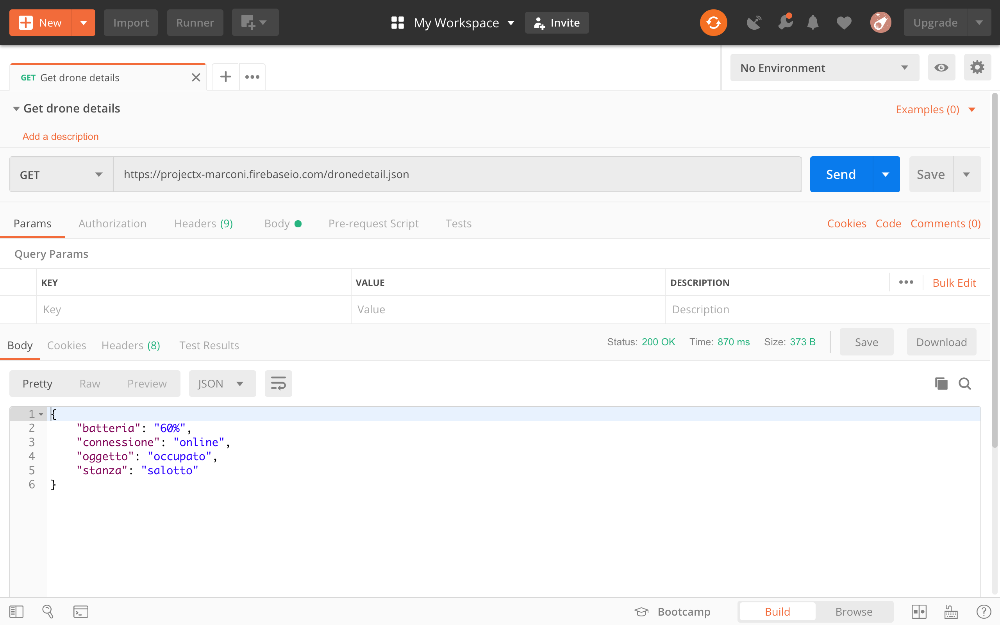

# Postman

Provare una chiamata HTTP con il metodo GET è facile: basta scrivere l'indirizzo sulla barra di un browser. Provare gli altri metodi è più complesso, e può involvere la scrittura di un programma di test in qualche linguaggio, ad esempio JavaScript. Il problema di questo approccio è che fare il test di tante richieste diverse diventa complicato, e si perde più tempo a scrivere e modificare lo script che a fare i test.

Per risolvere questo problema, esistono delle suite di test specifiche per le chiamate HTTP. Una delle applicazioni più usate al momento è [Postman](https://www.getpostman.com/).

La prima volta che lanciamo l'applicazione ci viene chiesto di registrarci, ma possiamo saltare questo passaggio premendo su "skip" in basso.

Una volta aperta l'applicazione, creiamo una nuova collezione dando un nome a piacere, ad esempio "Book HTML5"

## GET
All'interno della collezione appena creata, aggiungiamo una "Request" che possiamo chiamare ad esempio "Get drone details". Mettiamo nel campo URL il link alla risorsa, nel nostro caso [https://projectx-marconi.firebaseio.com/dronedetail.json](https://projectx-marconi.firebaseio.com/dronedetail.json), e premiamo Send.

</a>

Nella parte in basso ci sono i dati relativi alla riposta del server, in cui possiamo leggere il JSON restituito dal database.

## PUT
Immaginiamo ora di voler modificare il valore della batteria, e portarlo al 70%.

Creiamo una nuova request premendo il "+" nella barra in alto di Postman, quindi:
- seleziamo il metodo PUT
- inseriamo nel campo URL il link alla risorsa di nostro interesse, nel nostro caso [https://projectx-marconi.firebaseio.com/dronedetail/batteria.json](https://projectx-marconi.firebaseio.com/dronedetail/batteria.json)
- subito sotto l'URL, selezionamo "Body", quindi "raw" e cambiamo il formato da "text" a "json"
- inseriamo il nuovo valore in formato JSON, in questo caso `"70%"` (compresi i doppi apici)
- premiamo SEND

</a>

Nel body della response in basso vedremo lo stesso valore che abbiamo inserito, che corrisponde al nuovo valore nel database. In pratica ci da conferma che l'operazione è andata a buon fine.
