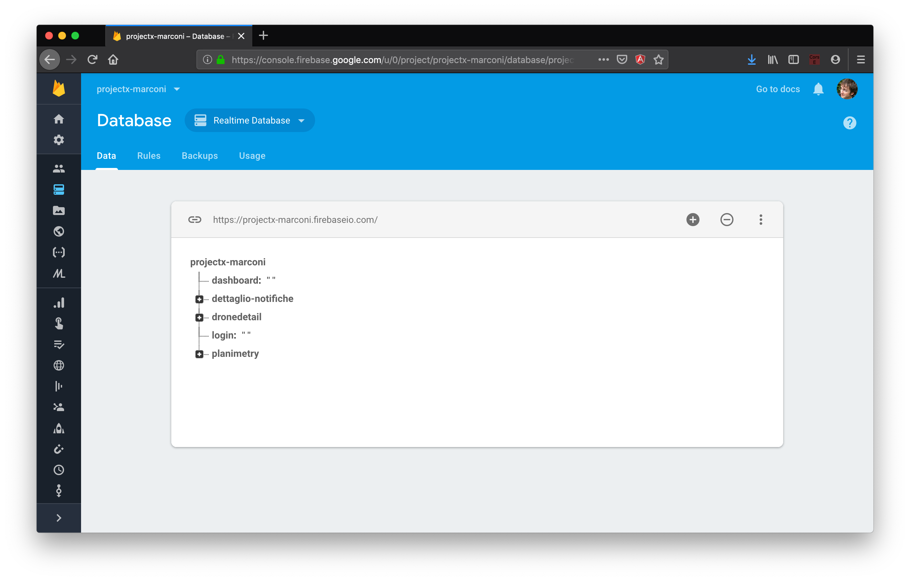

# Operazioni CRUD

Quando interagiamo con un qualsiasi database, sappiamo bene che esistono diverse categorie di comandi per interrogarlo e manipolarlo. In generale, i diversi comandi rientrano all'interno delle operazioni cosiddette **CRUD**: **C**reate, **R**ead, **U**pdate e **D**elete.

I database SQL e NoSQL usano strategie diverse per eseguire queste operazioni. Di seguito una tabella riassuntiva di confronto.

| Operazione  | SQL | NoSQL (HTTP) |
|---|---|---|---|---|
| Create |INSERT|POST (o PUT)|
| Read  |SELECT|GET|
| Update  |UPDATE|PUT / PATCH|
| Delete  |DELETE|DELETE|

## Selezione della risorsa
In NoSQL, per selezionare l'elemento che si vuole creare o modificare, bisogna identificare **l'URL** della risorsa.

In generale, avremo un URL base che identifica il database, e un path relativo che identifica la risorsa all'interno del db.

Facciamo un esempio con il database di Google Firebase che abbiamo creato.

</a>

Il path base del database in questo caso è [https://projectx-marconi.firebaseio.com/](https://projectx-marconi.firebaseio.com/). Per scaricare una risorsa, dobbiamo aggiungere `.json` alla fine del path. Per esempio, se vogliamo scaricare tutto quanto il database, possiamo usare:

[https://projectx-marconi.firebaseio.com/.json](https://projectx-marconi.firebaseio.com/.json)

Provando a cliccare su questo link con il browser, vedrete che scaricherete tutto il database in formato JSON. Questo perché quando clicchiamo su un link, il browser di default usa il metodo GET.

Se vogliamo invece scaricare solo il contenuto, ad esempio, di `dronedetail`, dobbiamo usare:

[https://projectx-marconi.firebaseio.com/dronedetail.json](https://projectx-marconi.firebaseio.com/dronedetail.json)

Come vedete cliccando sul link, in questo caso abbiamo ottenuto solo la porzione di db che ci interessa.

## Modifica della risorsa
Per modificare la risorsa, il ragionamento è simile. Troviamo il path della risorsa da modificare, ed usiamo `POST` e `PUT` in base al tipo di operazione che vogliamo eseguire.

### Idempotenza
Quale usiamo tra `POST` e `PUT`? Per rispondere, introduciamo brevemente il concetto di idempotenza. Un comando si chiama _idempotente_ se "_richieste ripetute identiche devono portare al medesimo stato dei dati sul server_". Per semplificare, pensate ad esempio ad una UPDATE in SQL. Se chiamate più volte UPDATE con gli stessi parametri, le chiamate successive alla prima non avranno effetto sulla riga da aggiornare. Pensate ora alla INSERT. Se chiamate più volte INSERT con gli stessi parametri (ipotizzando una assegnazione automatica della chiave primaria), ad ogni chiamata il database andrà ad aggiungere una nuova riga.

La stessa cosa per le chiamate HTTP con NoSQL.

PUT è idempotente: facendo più richieste HTTP PUT, il DB viene (eventualmente) modificato solo la prima volta.

POST non è idempotente: facendo più richieste HTTP POST, ad ogni chiamata verrà aggiunta una nuova risorsa e creata una chiave primaria per noi.

Approfondimento sul concetto di idempotenza [qui]( http://blog.loris.tissino.it/2013/06/http-rest-e-api.html).

## Esempio (quasi) completo
Per avere un esempio pratico di quanto detto, rimando al progetto di classe dell'[applicazione del bar](https://github.com/marconicivitavecchia-bar/bar-prof/blob/master/code/app.js).

In questo esempio, viene fatta una `GET` per scaricare tutto il database, ed una `PUT` per modificare la quantità richiesta di un certo prodotto.
