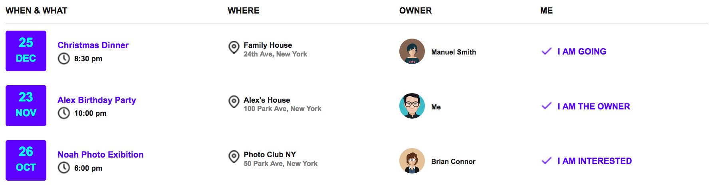
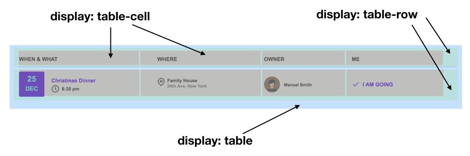
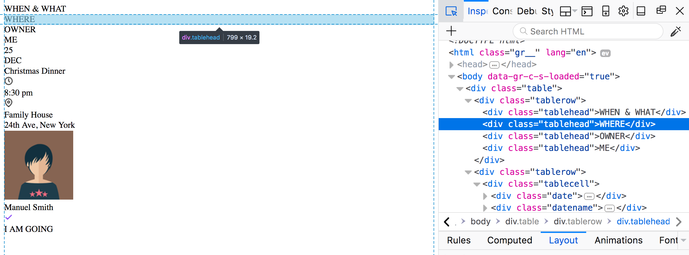

# HTML
Immaginiamo che il reparto di design ci abbia consegnato questo visual da realizzare:

<p align="center">

</p>

Inoltre ci ha fornito inoltre gli artefatti grafici qui di seguito:


In un contesto reale il reparto design potrebbe (auspicabile, ma non è detto) averci fornito anche le distanze in pixel o percentuale tra i vari elementi, ma in questo caso li deduciamo direttamente dal visual.

È fortemente consigliato di provare prima ad implementare da soli l'HTML e il CSS, e poi vedere l'implementazione proposta qui. Non c'è una implementazione giusta o sbagliata in assoluto, l'importante è che rispetti il visual e sia quanto più possibile "pulita" e facile da rendere responsive. Nota: per salvare gli artefatti grafici, cliccate con il tasto destro e premere salva.

Quando avete finito o se volete vedere subito la soluzione...cominciamo!

## Layout
Possiamo implementare questa lista in vari modi. Ad esempio:
- con i tag `<ul>` e `<li>`: in questo caso definiamo le varie righe come elementi di una lista
- con i tag `<table>`: da evitare, perché sarebbe difficile da gestire in maniera responsive
- con le proprietà CSS `display: table-*`: usiamo solo il tag `div` nell'HTML e definiamo il layout nel CSS.

Proviamo la terza strada, perché molto usata e ci permette di impratichirci sia con l'HTML che con il CSS.

Dobbiamo quindi dividere il visual in vari elementi, in accordo con le proprietà `display:table-*`. Per riferimento guardate [qui](https://www.w3schools.com/cssref/pr_class_display.asp).

<p align="center">

</p>

Ora scriviamo l'HTML e agganciamo le classi che andremo a definire nel foglio di stile.

## HTML

Per prima cosa definiamo il `<div>` per l'intera tabella:

```html
<div class="table">
 <!-- la tabella qui -->
</div>
```

Notare che il nome `table` assegnato alla classe è a nostra discrezione. Ci serve per poter in seguito agganciare il CSS.

Aggiungiamo due righe della tabella, la prima per l'intestazione e la seconda per la prima riga del corpo. Le altre righe del corpo sono del tutto identiche, basterà fare copia-incolla.

```html
<div class="table">
  <div class="tablerow">
      <!-- mettere intestazione tabella qui -->
  </div>
  <div class="tablerow">
      <!-- mettere prima riga del corpo tabella qui -->
  </div>

</div>
```

Riempiamo ora la riga di intestazione:

```html
<div class="table">
  <div class="tablerow">
      <div class="tablehead">WHEN & WHAT</div>
      <div class="tablehead">WHERE</div>
      <div class="tablehead">OWNER</div>
      <div class="tablehead">ME</div>
  </div>
  <div class="tablerow">
      <!-- mettere corpo tabella qui -->
  </div>
</div>
```

Anche qui `tablehead` è un nome che abbiamo scelto noi. Notare che abbiamo definito una classe specifica per le celle dell'header perché avranno uno stile diverso rispetto a quelle del corpo.

Ora aggiungiamo le quattro celle per la riga del corpo della tabella. Per ora le creaimo vuote:

```html
<div class="table">
    <div class="tablerow">
        <div class="tablehead">WHEN & WHAT</div>
        <div class="tablehead">WHERE</div>
        <div class="tablehead">OWNER</div>
        <div class="tablehead">ME</div>
    </div>
    <div class="tablerow">
        <div class="tablecell">
            <!-- mettere contenuto cella -->
        </div>
        <div class="tablecell">
            <!-- mettere contenuto cella -->
        </div>
        <div class="tablecell">
            <!-- mettere contenuto cella -->
        </div>
        <div class="tablecell">
            <!-- mettere contenuto cella -->
        </div>
        </div>
    </div>
</div>
```

Ora dobbiamo riempire ognuna delle quattro celle, con il contenuto ed il layout corretto.

<a name="html-first-cell"></a>

Cominciamo con la prima cella, la dividiamo nei seguenti `<div>`, con le relative classi:

<p align="center">

</p>

L'implementazione in HTML sarà la seguente:

```html
<div class="date">25<br><span class="month">DEC</span></div>
<div class="datename">Christmas Dinner<br>
    
    <div class="hour">8:30 pm</div>
</div>
```

Ragionando in maniera del tutto analoga anche per le altre celle, otteniamo il seguente codice HTML dell'intera riga:

```html
<div class="table">
    <div class="tablerow">
        <div class="tablehead">WHEN & WHAT</div>
        <div class="tablehead">WHERE</div>
        <div class="tablehead">OWNER</div>
        <div class="tablehead">ME</div>
    </div>
    <div class="tablerow">
        <div class="tablecell">
            <div class="date">25<br><span class="month">DEC</span></div>
            <div class="datename">Christmas Dinner<br>
                
                <div class="hour">8:30 pm</div>
            </div>
        </div>
        <div class="tablecell">
            <div class="locationname">Family House<br><span class="address">24th Ave, New York</span></div>
        </div>
        <div class="tablecell">
            <div class="name">Manuel Smith</div>
        </div>
        <div class="tablecell">
            <div class="answer">I AM GOING</div>
        </div>
    </div>
</div>
```

Questa pagina renderizzata (ovvero aperta in un browser) appare così:

<p align="center">

</p>

Bene, c'è tutto!

Ma perché gli elementi vengono visualizzati tutti **uno sotto l'altro**? Questo dipende dal fatto che abbiamo usato i tag `<div>` che sono **di tipo block**, che per [definizione](https://www.w3schools.com/html/html_blocks.asp) partono sempre da una nuova riga e occupano tutta la larghezza possibile. Per vedere gli ingombri "dal vero" possiamo aprire i developer tools di Firefox, Chrome o Safari e selezionare un elemento, per esaminare lo spazio occupato dal suo box.

Ad esempio, in questa immagine abbiamo selezionato la cella "WHERE" con i developers tool di Firefox Quantum.

<p align="center">

</p>

Come facciamo ad ottenere il layout corretto? Useremo delle proprietà CSS che vedremo tra poco.

[qui](https://jsfiddle.net/Savinss/mpunwj7z/1/)
