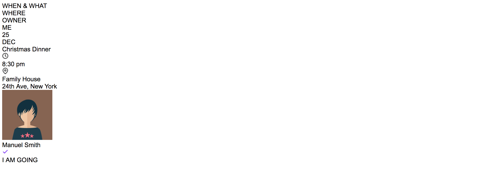
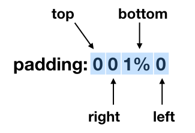
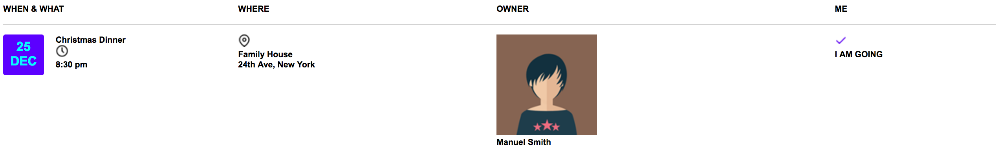

# CSS

Creiamo il nostro foglio di stile e lo chiamiamo `style.css`. Lo linkiamo alla pagina HTML inserendo all'interno del tag `<head>` questa riga:

```html
<link rel="stylesheet" href="style.css">
```
> In VSCode, digitando link:css, si avvia l'autocompletamento.

> In questo caso non avrebbe senso mettere lo stile inline perché dovremmo ripeterlo per ogni tag di riga e cella. Avremmo potuto mettere lo stile in testa alla pagina, ma **è buona norma metterlo in un file separato**, per poterlo gestire più facilmente.

Apriamo il nostro foglio di stile e cominciamo a scaldarci. Per prima cosa, cambiamo il font di default a tutta la pagina, usando il selettore universale asterisco:

```css
* {
    font-family: Arial, Helvetica, sans-serif
}
```

> In VSCode, digitando font-family, si avvia l'autocompletamento di tutta la riga, compresi i valori della proprietà.

Aggiorniamo la pagina e vediamo se è cambiato qualcosa:
<p align="center">

</p>

Wow, il font è cambiato davvero :)

Ora creiamo lo scheletro del nostro CSS in accordo con le classi che abbiamo definito nell'HTML:

```css
* {
    font-family: Arial, Helvetica, sans-serif
}

.table {

}

.tablerow {

}

.tablehead {

}

.date {

}

.hour {

}

.month {

}

.datename {

}

.locationname {

}

.avatar {

}

.iconclock {

}

.iconlocation {

}

.iconcheck {

}

.address {

}

.name {

}

.answer {

}

```

Per prima cosa inseriamo le proprietà display, per creare la tabella:

```css
.table {
    display: table;
}

.tablerow {
    display: table-row;
}

.tablehead {
    display: table-cell;
}

.tablecell {
    display: table-cell;
}
```

Che viene renderizzato così:
<p align="center">

</p>

OK, abbiamo una disposizione a tabella. Ora dobbiamo lavorare sulle singole classi per adattare lo stile.

Per prima cosa lavoriamo sulla classe `.table`: vogliamo che occupi tutto lo spazio disponibile, quindi aggiungiamo la proprietà `width: 100%`.

```css
.table {
    display: table;
    width: 100%;
}
```
<p align="center">

</p>


Ora lavoriamo sull'header. Vogliamo che:
- ci sia una linea continua sotto, di color grigio chiaro (`border-bottom`)
- il testo sia leggermente spostato in alto rispetto al bordo (`padding`)
- il carattere sia di 8 punti e grassetto (`font-size` e `font-weight`)

Aggiungiamo le proprietà per queste modifiche:

```css
.tablehead {
    display: table-cell;
    border-bottom: 1px solid lightgrey;
    padding: 0 0 1% 0;
    font-size: 8pt;
    font-weight: bolder;
}
```

Attenzione al campo padding: come per tutte le proprietà del box model, se si specificano quattro valori vengono interpretati come:

<p align="center">

</p>

Ed ecco il risultato:
<p align="center">

</p>

Lavoriamo sulle celle del corpo della tabella. Vogliamo che tutte le celle di default abbiano le seguenti caratteristiche:
- un po' di padding in alto ed in basso
- il carattere di 8 punti e grassetto
- allineamento verticale in alto, invece del default in basso (`vertical-align`)

```css
.tablecell {
    display: table-cell;
    padding: 1% 0 1% 0;
    font-size: 8pt;
    font-weight: bold;
    vertical-align: top;
}
```
<p align="center">

</p>

Ora lavoriamo sulla prima cella. Come abbiamo visto [prima](#html-first-cell), questa cella è divisa in due parti: la data a sinistra e i dettagli a destra.

Per il `<div>` della data, dobbiamo fare le seguenti cose:
- il campo data deve essere un quadrato (`width` e `heigth`) con i bordi arrotondati (`border-radius`)
- lo sfondo blu (`background`) e cambiamo anche il colore del testo (`color`)
- il font di dimensione 12 punti e grassetto, centrato (`text-align`)
- un po' di padding in tutte e quattro le direzioni
- un po' di margine solo a destra (`margin-right`)

```css
.date {
    width: 40px;
    height: 40px;
    border-radius: 3px;
    background: #5c00ff;
    color: #00fdff;
    font-size: 12pt;
    font-weight: bolder;
    text-align: center;
    padding: 2%;
    margin-right: 5%;
}
```

<p align="center">

</p>


Uhm...la data è OK ma il testo dovrebbe stare a destra, invece che sotto. Per risolvere questo problema possiamo usare la proprietà CSS `float`, che imposta il blocco in modo che deve _flottare_ e non occupare tutta la larghezza disponibile nella pagina. Nel nostro caso il blocco `<div>`  deve _flottare a sinistra_, quindi usiamo la prorietà float con valore left:
```css
.date {
    ...
    float:left;
}
```
<p align="center">

</p>

Hooray! Prima di andare avanti però **attenzione**: la proprietà `float` ha un effetto che si propaga a tutti gli elementi che ha accanto ed in cui è contenuto, e questo può avere degli effetti indesiderati. È buona norma quindi interrompere la propagazione da qualche parte con la proprietà `clear:both`: noi la aggiungiamo alla classe `.tablecell`.

```css
.tablecell {
    ...
    clear: both;
}
```

### Mettiamo insieme i pezzi
A questo punto abbiamo tutti i pezzi che ci servono, ci rimane solo da aggiungere le proprietà giuste nel posto giusto. Il risutato finale è questo.

```css
* {
    font-family: Arial, Helvetica, sans-serif
}

.table {
    display: table;
    width: 100%;
}

.tablerow {
    display: table-row;
}

.tablehead {
    display: table-cell;
    border-bottom: 1px solid lightgrey;
    padding: 0 0 1% 0;
    font-size: 8pt;
    font-weight: bolder;

}

.tablecell {
    display: table-cell;
    padding: 1% 0 1% 0;
    font-size: 8pt;
    font-weight: bold;
    vertical-align: top;
    clear: both;
}

.date {
    width: 40px;
    height: 40px;
    border-radius: 3px;
    background: #5c00ff;
    color: #00fdff;
    font-size: 12pt;
    font-weight: bolder;
    text-align: center;
    padding: 2%;
    float: left;
    margin-right: 5%;
}

.hour {
    color: #161616;
    font-size: 7pt;
    margin: 5px 0 0 5px;
    float: left;
}
.month {
    font-size: 9pt;
    font-weight: bold;
}

.datename {
    float: left;
    margin-top: 12px;
    color: #5c00ff;
}

.locationname {
    font-size:7pt;
    margin:13px 0 0 20px;
}

.avatar {
    width:32px;
    height:32px;
    border-radius:100px;
    float:left;
    margin-top:10px;
}

.iconclock {
    float: left;
    margin-top: 2px;
}

.iconlocation {
    float:left;
    margin-top:13px;
}

.iconcheck {
    float:left;
    margin-top:18px;
}

.address {
    font-size:6.5pt;
    color:grey;
}

.name {
    margin:22px 0 0 40px;
    font-size:6.5pt;
}

.answer {
    color: #5c00ff;
    margin:20px 0 0 22px;
}
```

Che ci porta a questo risultato:
<p align="center">

</p>

Era proprio quello che volevamo :D

Adesso avete tutte le basi che vi servono per realizzare le vostre pagine. Buon lavoro.
