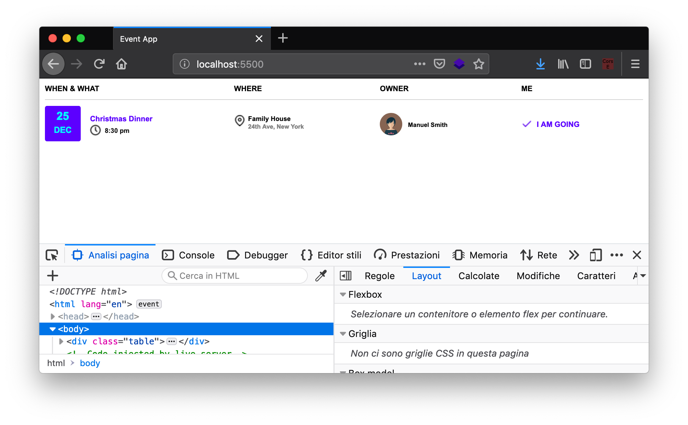

<style>
.centered {
	text-align: center;
}
img.right_side {
  float: right;
  margin:5px 5px 0px 20px;
  width: 30%;
}
img.left_side {
  float:left;
  margin:5px 20px 0px 5px;
  width: 20%;
}

p.clear {
  clear: both;  
}
p.img-container {
  margin-bottom: 15px;


}

p.img-container::after {
  margin-bottom: 15px;
  overflow: hidden;
  clear: both;
}
</style>

# JavaScript

La pagina fin qui creata è _statica_, ovvero i dati degli eventi sono scritti in maniera fissa, non modificabile, all'interno del file HTML. Chiaramente non è quello che vogliamo, perché il nostro obiettivo è che ogni volta che l'utente apre la pagina, gli mostri gli eventi aggiornati in quel momento: vogliamo una pagina _dinamica_. Per fare questo ci serve l'ultimo componente di HTML5: JavaScript.

## Un po' di storia
<p class="img-container">


</p>

JavaScript è nato all'interno della <a href="https://it.wikipedia.org/wiki/Netscape_Navigator">Netscape</a>, la società americana che sviluppò nel 1993 il primo web browser grafico di larga diffusione (ricordiamo che il web è nato nel 1989 in Europa). Nel 1995 cercavano una tecnologia per rendere dinamiche le pagine web, e diedero l'incarico al neo-assunto <a href="https://en.wikipedia.org/wiki/Brendan_Eich">Bernard Eich</a> di creare un linguaggio di programmazione per competere con i rivali (Java e Microsoft). Gli diedero 10 giorni di tempo, nel maggio 1995.

Eich riuscì nell'impresa e creò il linguaggio JavaScript, definito nel suo [annuncio ufficiale](https://web.archive.org/web/20070916144913/http://wp.netscape.com/newsref/pr/newsrelease67.html) come "open, cross-platform object scripting language" che avrebbe dovuto "complementare il linguaggio Java".

[Sembra](https://www.crockford.com/javascript/javascript.html) che il prefisso Java sia stato scelto intenzionalmente per creare confusione e per scherzo. In ogni caso la Sun Microsystem, che deteneva i diritti di Java a quel tempo, non protestò, e cosi è rimasto questo nome.

<p class="img-container">


</p>

Da allora il linguaggio è cresciuto in funzionalità e diffusione, fino ad arrivare nel 2019 ad essere tra i 10 linguaggi più usati al mondo, in continua crescita. La sua vitalità è testimoniata dagli standard in continuo aggiornamento. Le funzionalità di JavaScript sono infatti definite e standardizzate dalla [ECMA](https://www.ecma-international.org/) (European Computer Manufacturers Association), con sede a Ginevra. L'ultima versione dello standard JavaScript si chiama ES2017 (anche detto ES8, giusto per creare un po' più di confusione).


La nascita un po' casuale di questo linguaggio è uno dei motivi per cui molte cose in JavaScript non hanno una ragione particolare, almeno nella versione classica (fino allo standard ES5 del 2009).

Inoltre, JavaScript lascia molta libertà agli sviluppatori di decidere il loro stile di programmazione. Questo fa sì che, senza delle linee guida condivise tra sviluppatori, il codice scritto da persone diverse finisce per essere incompatibile o incomprensibile. Per evitare il problema, è necessario scegliere una linea guida comune. Ne esistono molte, io personalmente suggerisco [questa](https://crockford.com/javascript/code.html) di Douglas Crockford, semplice ma completa.

## Agganciare HTML e JS
Cominciamo creando un file nella stessa cartella dell'index, e lo chiamiamo `app.js`. Per fare una prova, per ora mettiamo solo la visualizzazione di un pop-up, che in JavaScript si ottiene con la funzione `alert()`.

```js
alert("JS test");
```

Se proviamo ora ad aggiornare la nostra pagina, non succede niente. Perché?

Come abbiamo detto, **tutto parte sempre dall'HTML**. Il nostro browser comincia a leggere il file HTML che abbiamo indicato con l'URL nella barra di navigazione, e riga dopo riga interpreta quello che c'è scritto. Dobbiamo quindi mettere nel nostro `index.html` l'istruzione per dirgli di andare a leggere il file.

Il tag necessario per questa operazione è **`<script>`**, a cui bisogna specificare come attributo il nome del file che vogliamo caricare. Ecco il codice che ci serve:

```html
<script src="app.js"></script>
```

Dove mettiamo questo codice? Nei testi viene suggerito di mettere il tag `<script>` all'interno del tag `<head>`, e noi seguiremo questo suggerimento. Ma attenzione: di default il browser eseguirà tutto il codice dentro il nostro script e **solo dopo** continuerà ad interpretare la pagina, con la conseguenza l'utente potrebbe avvertire una fastidiosa sensazione di lentezza.

> Se volete evitare che la lettura dello script rallenti il caricamento della pagina, avete diverse possibilità:
> - spostare il tag script alla fine della pagina, subito prima della chiusura del tag `</body>`, oppure
> - aggiungere l'attributo "async" o "defer" al tag script, per dettagli vedi [HTML script tag](https://www.w3schools.com/tags/tag_script.asp) nella sezione "Tips and Notes"

> Come sempre in VSCode, digitando script:src si avvia l'autocompletamento.


Avviando la pagina otteniamo la seguente cosa.
<p align="center">

</p>

Bene, il file JavaScript è collegato correttamente! 🥳

Prima di andare avanti, vogliamo semplificarci un po' le cose usando una libreria molto diffusa che permette di ridurre drasticamente il codice da scrivere per eseguire operazioni comuni: jQuery.

> Un'altra libreria molto usata è [Lodash](https://lodash.com/), che semplifica la manipolazione di array, stringhe e oggetti.

## Importare jQuery
[jQuery](https://jquery.com/) (pronuncia _jeiquiri_) è una delle librerie più diffuse per JavaScript, perché permette di semplificare e velocizzare operazioni che altrimenti richiederebbero un bel po' di linee di codice. Per scaricare l'ultima versione, andate sul sito ufficiale, sezione Download, e selezionate la versione "Download the compressed, production jQuery". Se volete scaricare il file, vi conviene premere con il tasto destro sul link e selezionare "Salva destinazione con nome..." o l'equivalente nel vostro broser. Come al solito, salvate il file nella stessa cartella dove si trova il file html.

<p align="center">

</p>

> Attenzione: la semplificazione offerta da jQuery non è gratis. Questa libreria è piuttosto pesante ed il browser ci metterà un po' di tempo a caricarla, con il rischio di inficiare l'esperienza utente. Quando diventerete sviluppatori front-end professionisti, dovrete fare attenzione anche a queste cose. Il codice JavaScript "puro", senza l'uso di nessuna libreria, è anche detto _VanillaJS_; [qui](http://vanilla-js.com/) trovate un sito scherzoso sull'argomento.

Colleghiamo il file nel nostro progetto, mettendo il tag script _prima_ dell'inclusione del nostro file JavaScript. Questo è fondamentale perché, come abbiamo detto, il browser interpreta le linee in ordine, quindi è necessario prima importare jQuery, e dopo il nostro codice che dipende da questa libreria.

```html
<script src="jquery-3.3.1.min.js"></script>
<script src="app.js"></script>
```

È interessante notare come non sia possibile importare una dipendenza direttamente all'interno del file JavaScript, ma bisogna passare per il file HTML.

> Per risolvere questo problema, sono nati vari framework più o meno complessi che permettono di gestire le dipendenze in maniera efficente ed efficace. Chi è interessato, può ad esempio studiarsi [Webpack](https://webpack.js.org/).

## Primi passi con jQuery
Per cominciare ad usare jQuery, dobbiamo inizializzare la libreria. Andiamo sul nostro file JavaScript e aggiungiamo il seguente snippet di codice.

```js
var init = function() {
  alert("JS test with Jquery");
}

$(document).ready(init);
```

Vediamo in dettaglio cosa abbiamo fatto. Partiamo dall'ultima riga.
```js
$(document).ready(init);
```

Il simbolo `$` è il nome della variabile oggetto messa a disposizione dalla libreria jQuery. In JavaScript infatti, il dollaro è un carattere valido per l'inizio di una nome di una variabile o funzione.

> jQuery mette a disposizione solo la variabile `$`. Pubblicare una sola variabile è una cosa molto comune in JavaScript, come vedremo.

La **variabile `document`** è invece messa a disposizione dal browser e contiene tutte le informazioni che riguarda la pagina html e i relativi fogli di stile CSS. È il nostro punto di contatto tra l'html e gli script JavaScript.

L'espressione `$(document)` serve a _inizializzare_ la libreria jQuery con il documento corrente. In questo modo inoltre jQuery prende il controllo del documento, e noi non andremo _mai più_ ad usare la variabile `document` direttamente, ma passeremo sempre attraverso l'oggetto `$()`.

Immediatamente dopo l'inizializzazione viene chiamato il metodo `.ready()`, che richiede come parametro _una funzione_. Passare come parametri funzioni è una cosa estremamente comune in JavaScript, e anche noi la useremo estensivamente. Il metodo `ready` invocherà la funzione passatagli come parametro, nel nostro caso `init`, quando il caricamento della pagina sarà completo e quindi saremo pronti per il processamento del documento.

Vediamo ora come abbiamo dichiarato la funzione `init`.

```js
var init = function() {
  alert("JS test with Jquery");
}
```

Facciamo particolare attenzione a questa sintassi. Abbiamo dichiarato la variabile `init`, ed abbiamo usato l'operatore di assegnazione (il simbolo `=`) per assegnarli come valore una funzione. In questo modo abbiamo di fatto creato una variabile che può essere invocata come una funzione (ovvero con le parentesi tonde, `init()`).

> La funzione dichiarata in questo modo _non_ ha un nome suo, infatti non c'è nessun identificativo fra la keyword `function` e le parentesi tonde che seguono. Questo tipo di funzioni si chiamano _anonime_, in inglese _anonymous-functions_. Chi vuole approfondire può leggere [questo articolo](http://helephant.com/2008/08/23/javascript-anonymous-functions/).

Se ora ricarichiamo la pagina, otteniamo un comportamento molto simile al procedente.

<p align="center">

</p>

## Scope di funzione
Prima di andare avanti, è bene impostare correttamente il file JavaScript. Questo linguaggio infatti lascia moltissima libertà ai programmatori nell'organizzazione del codice, e questa è una buona cosa perché è possibile creare librerie e framework molto potenti, ma senza un po' di disciplina si finsce con lo scrivere del codice che è completamente non mantenibile e soggetto ad infiniti tipi di bug. Rimandiamo al link all'inizio di questa pagina per una syle-guide.

> Fate particolare attenzione quando copiate-incollate codice da Internet. Assicuratevi che sia scritto bene, e che segua le vostre convenzioni. Alcune stime non ufficiali dicono che l'80% del codice JavaScript reperibile su Internet è monnezza, quindi state in guardia.

Per cominciare, bisogna sapere che le variabili in JavaScript dichiarate con `var` hanno uno **scope di funzione**, ovvero sono visibili in tutta la funzione in cui sono state dichiarate, _indipendentemente dal file o dal blocco in cui si trovano_.

Cosa significa in pratica? Significa che i seguenti due snippet di codice sono equivalenti:
```
function() {
	var myName = "Harry";
	if (myName == "Harry") {
		var myFriend = "Ron";
		alert("myFriend name is "+ myFriend);
	}
}
```
```
function() {
	var myName = "Harry";
	var myFriend = "Ron";
	if (myName == "Harry") {
		alert("myFriend name is "+ myFriend);
	}
}
```
Come vedete, la variabile `myFriend` è salita fino in cima alla funzione, uscendo dallo scope dell'`if` da cui era definita. Questo è un comportamento inusuale, rispetto ad altri linguaggi, e potenzialmente rischioso! Infatti si rischia un conflitto di nomi tra variabili dichiarate anche lontano fra loro.

> Questo comportamento si chiama _hoisting_. Vedi la [documentazione ufficiale](https://developer.mozilla.org/it/docs/Glossary/Hoisting) per dettagli.

La cosa è particolarmente pericolosa se si dichiarano variabili al di fuori di tutte le funzioni. Cosa succede in questo caso? Le variabili vanno a finire nella funzione _globale_ del browser, che si chiama `window()`. Come sappiamo, le variabili globali sono estremamente pericolose perché potrebbero andare in conflitto in qualsiasi momento e in modo imprevedibile con altre variabili dichiarate chissà dove, da noi o da altre librerie.

Per evitare il più possibile di usare variabili globali, ci sono varie strategie. Noi ne useremo una semplice e molto diffusa:
- dichiariamo un unica variabile globale con lo stesso nome del file
- mettiamo tutte le variabili (stringhe, numeri, funzioni e altri oggetti) come proprietà e metodi di questo oggetto

> Se avete fatto attenzione, questo è anche il metodo usato da jQuery con la sua variabile `$`.

## Creazione dell'oggetto globale app
Creiamo quindi il nostro oggetto globale. Per dichiarare un oggetto in JavaScript si usano le parentesi graffe. Un oggetto vuoto è quindi dichiarato così:

```js
var app = {};
```

Ogni proprietà e metodo all'interno dell'oggetto viene dichiarato con la sintassi `nome:valore`. Se vogliamo dichiarare ed assegnare la nostra funzione init all'interno di questo oggetto, la sintassi quindi sarà la seguente.

```js
var app = {
  init: function() {
    alert("JS test with Jquery");
  }
};
```

A questo punto il nostro file `app.js` avrà il seguente aspetto.
```js
var app = {
  init: function() {
    alert("JS test with Jquery");
  }
};

$(document).ready(app.init);
```

Notiamo che all'interno del metodo `ready` abbiamo messo ora `app.init`. Questo perché la variabile init non è più visibile dallo scope gloale, e dobbiamo quindi richiamarla all'interno dell'oggetto `app`.

Attenzione: non confondete le notazioni `app.init` (senza parentesi) e `app.init()` (con le parentesi). La prima notazione è la variabile che contiene la funzione: quando l'usate, la funzione stessa **non** viene richiamata. La funzione verrà realmente chiamata solo quando il documento è effettivamente pronto. Con la notazione `app.init()` invece noi stiamo chiamando la funzione, e passiamo alla funzione `ready` il _valore di ritorno_ della funzione `app.init`. Siccome nel nostro caso la funzione init non ritorna nessun valore, verrà passato il valore `undefined`, che è una keyword del linguaggio ed un valore speciale. Provare per credere.

# Debug di JavaScript
Come si fa a fare il debug di una applicazione in JavaScript?

Per fortuna quasi tutti i browser (a parte Explorer) hanno degli ottimi strumenti di sviluppo.

Quindi il flusso tipico di lavoro è questo:
- scrivete il codice con l'edito che preferite (VSCode, Notepad++, etc.)
- fate il debug con gli strumenti per sviluppatori del browser

Per aprire gli strumenti sviluppatori, il modo più semplice è cliccare con il tasto destro da qualche parte nella pagina e selezionare "Analizza elemento" su Firefox, "Ispeziona" su Chrome e Safari, etc.

<p align="center">

</p>

## Uso della console
L'uso della funzione `alert()` per comunicare informazioni di debug può risultare molto scomoda perché interrompe le operazioni dell'utente. Per evitare questo problema, potete usare la funzione `console.log()` che stampa sulla console di debug del browser.

Ad esempio il seguente codice:
```js
console.log("JS Test");
```

Risulterà nella seguente stampa di debug:
<p align="center">

</p>
