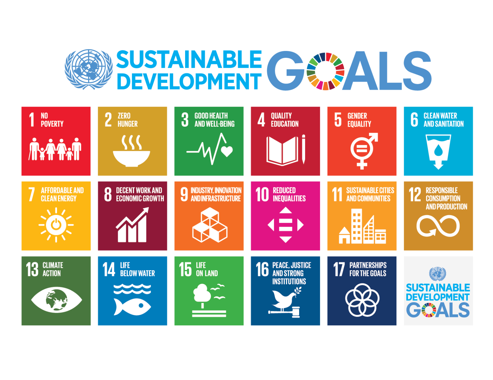
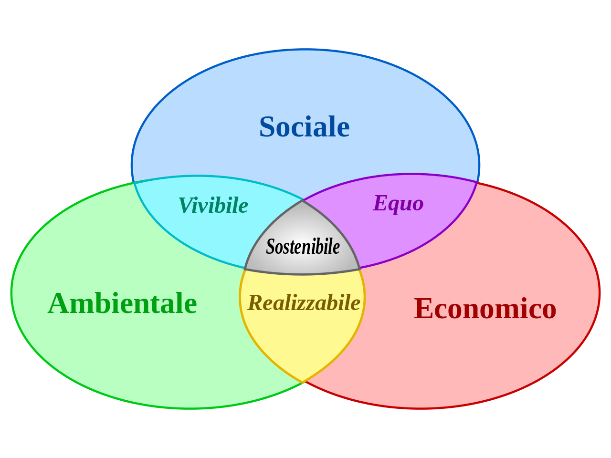
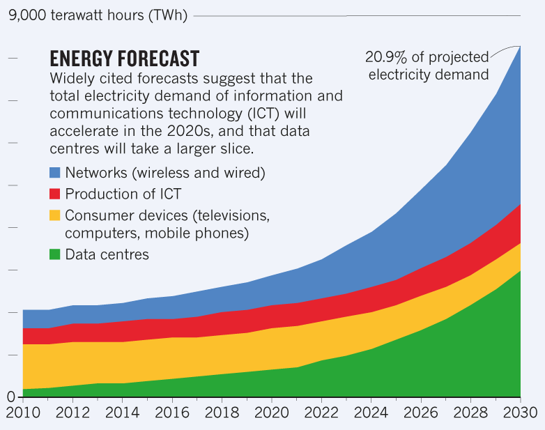
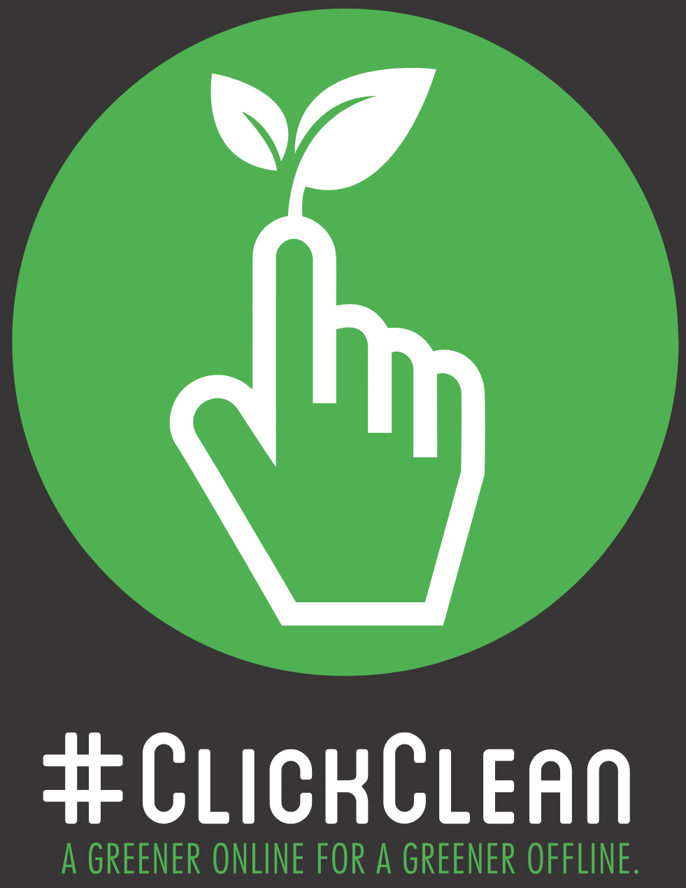

# Sostenibilità

Realizzare un sito bello, che funziona bene e che rispetti le richieste del cliente non è ancora abbastanza. Oggi infatti non possiamo più ignorare che qualsiasi nostra azione e progetto che realizziamo è strettamente interconnesso con tutto ciò che ci circonda ed ha un impatto sulla vita di tante persone e sull'ambiente, anche in modi che non ci potremmo immaginare.

## 17 obiettivi di sostenibilità
L'Organizzazione delle Nazioni Unite nell'assemblea generale del 2015 ha fissato [17 obiettivi](https://www.un.org/sustainabledevelopment/sustainable-development-goals/) da raggiungere entro il 2030, per rendere più sostenibile la vita sul nostro pianeta.

Tutti i goal sono associati a degli indicatori che possono essere misurati in maniera oggettiva: l'obiettivo è quindi raggiungere delle metriche chiave per ognuno di questi goal, o quantomeno migliorare le metriche attuali, per sapere se stiamo andando nella giusta direzione. Cliccando sull'immagine qui sopra potrete avere maggiori dettagli su ognuno di questi goal.

## Cosa significa sostenibilità
Ma cosa significa esattamente sostenibilità? Per rappresentare graficamente cosa si intende possiamo fare riferimento all'immagine qui sotto.

Possiamo pensare alla sostenibilità, ad esempio della nostra azienda, come l'intersezione di tre diversi campi:
- economico: dobbiamo poter ricavare del profitto, ovvero ricavare più di quanto spendiamo;
- ambientale: deve avere il minimo impatto possibile sull'ambiente in termini di consumi energetici, materie prime, consumo del territorio, etc.
- sociale: dobbiamo promuovere lo sviluppo sociale ed i diritti di tutti i nostri lavoratori e delle persone coinvolte dalla nostra azienda

## L'impatto di Internet

Noi lavoriamo nel campo dell'Internet Economy, dove spesso i consumi energetici sono nascosti. Pensiamo ad esempio quanta energia consumiamo quando vediamo un film su Netflix. Dobbiamo considerare:
- il consumo del dispositivo su cui stiamo guardando il film (es. SmartTV)
- il consumo del router a cui è connessa la TV
- il consumo di tutti gli switch ed altre apparecchiature che collegano il nostro router ai data center di Netflix
- il consumo dei server nei data center di Netflix
- il consumo per la produzione di tutte le apparecchiature qui sopra

Un articolo di [Nature](https://www.nature.com/articles/d41586-018-06610-y) mostra delle stime in percentuale di come sono suddivisi questi consumi.

Come si può vedere, i data center e le apparecchiature di rete diventeranno un fattore enorme di consumo energetico nei prossimi anni. Per questo bisogna agire, anche come consumatori responsabili di tecnologie, per fare in modo che questi valori di consumi crescano il meno possibile.

Di seguito un podcast che vi consiglio di ascoltare, sempre dall'articolo di Nature sopra citato.

<audio controls>
 <source src="assets/nature.mpga" type="audio/mpeg">
Your browser does not support the audio element.
</audio>

## ClickClean

Come facciamo nella pratica? Ovviamente non c'è una risposta semplice, ma qualcosa possiamo sicuramente farlo, per prima cosa informarci. Ad esempio, un report di Greenpeace del 2017, [ClickGreen](http://www.clickclean.org/), cerca di fare un po' di luce sulle fonti di energia usate dalle grandi aziende di Internet.

L'executive summary all'inizio del report riassume tutti i punti più importanti. La buona notizia è che le aziende legate ad Internet sono le tra le più virtuose dal punto di vista delle fonti rinnovabili, e stanno facendo da traino anche per le altre società. Purtroppo però le aziende basate in Cina, come noto, si basano fortemente su fonti di energia non rinnovabili; considerando che sono anche le aziende in maggior crescita, questo crea un problema globale di notevoli dimensioni che ci coinvolge tutti. È altrettanto vero però che la Cina è il paese che investe di più al mondo sull'energia rinnovabile, e quindi anche in questo campo sta innovando molto, a differenza degli Stati Uniti rimangono praticamente fermi...

## Conclusioni
Insomma lo scenario sulla sostenibilità è in continuo e rapido movimento, e bisogna rivedere continuamente le nostre "certezze" o credenze, lasciando da parte i luoghi comuni. Consiglio a tutti gli studenti di cercare di farsi delle conoscenze di prima mano, andando in giro per il mondo come viaggiatori e non come turisti e conoscendo persone di vari paesi...Buon viaggio, mandatemi una cartolina!

## Link utili
- [Ministero dell'ambiente italiano](http://www.minambiente.it/pagina/gli-obiettivi-e-i-target)
- [Banca d'Italia](https://www.bancaditalia.it)
- [Comunità Europea](https://ec.europa.eu)
- [Lifegate](https://www.lifegate.it)
- [Noi siamo pari](https://www.noisiamopari.it/)
- [Pari opportunità](http://www.pariopportunita.gov.it/)
- [Centro Regionale di Informazione delle Nazioni Unite](https://www.unric.org/it)
